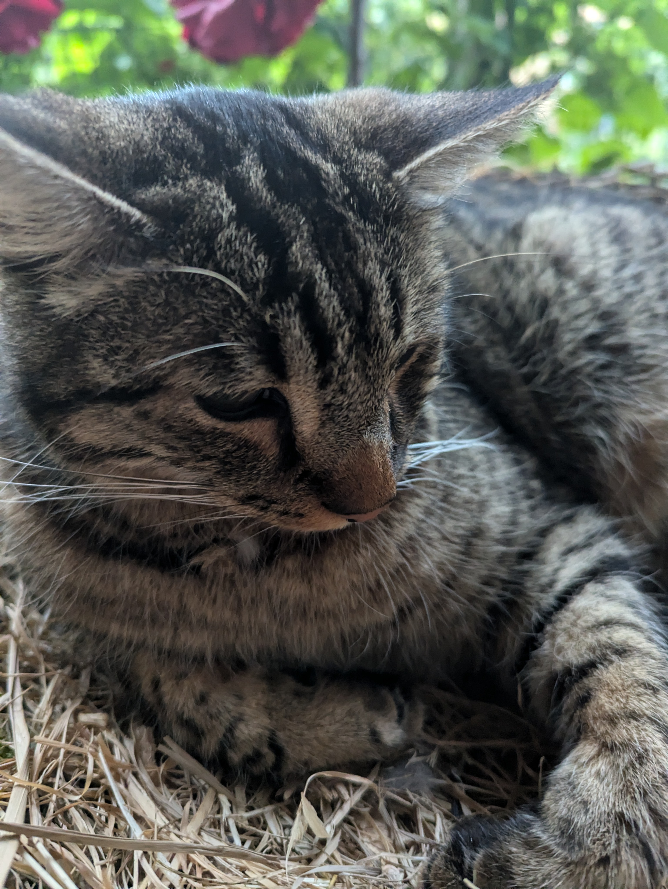
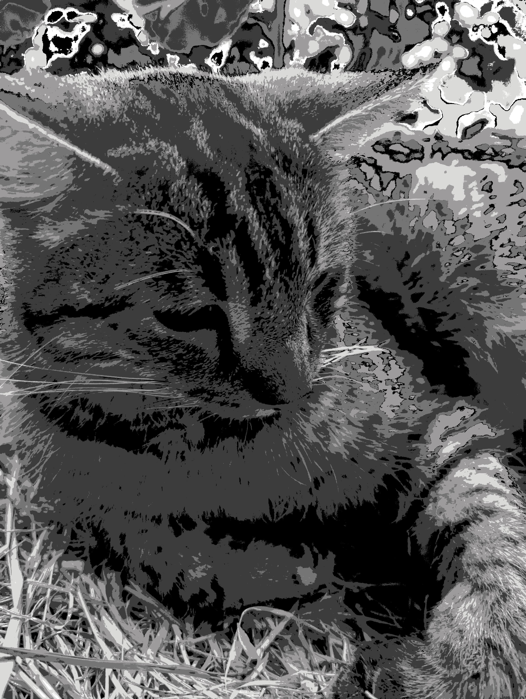
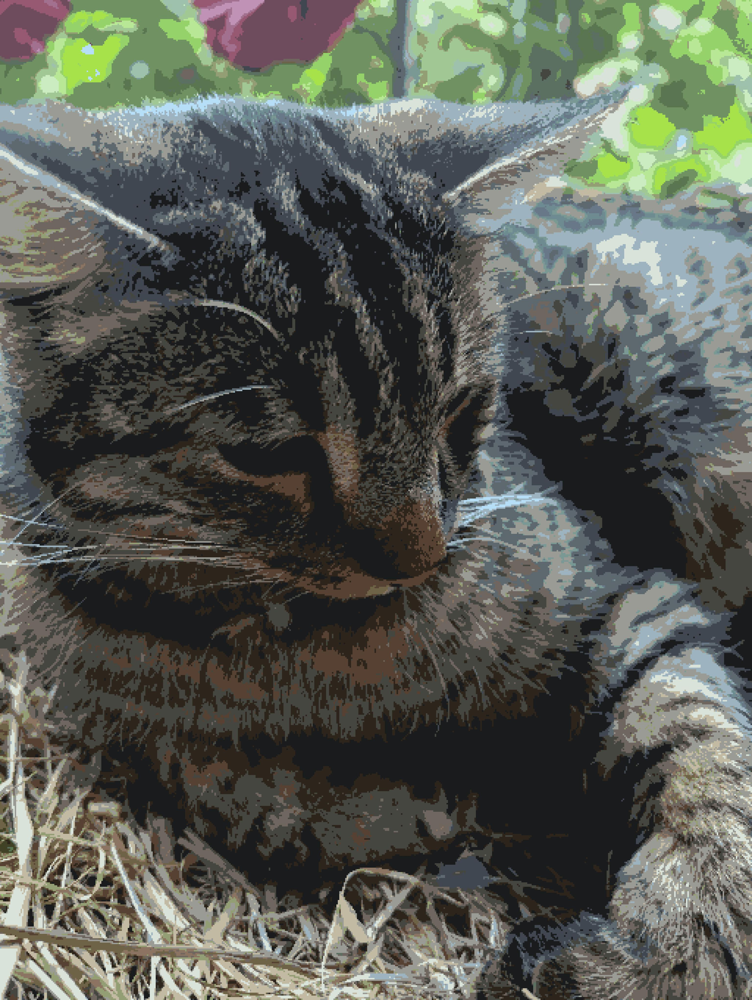
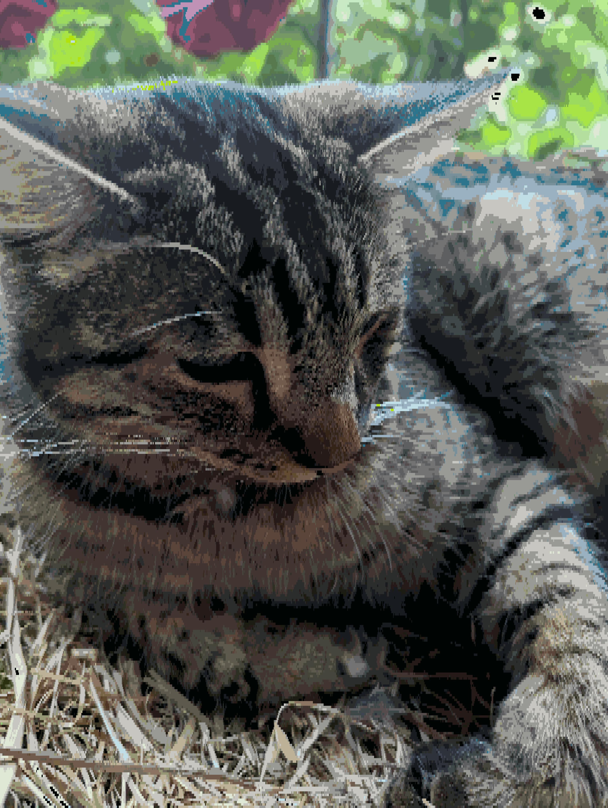
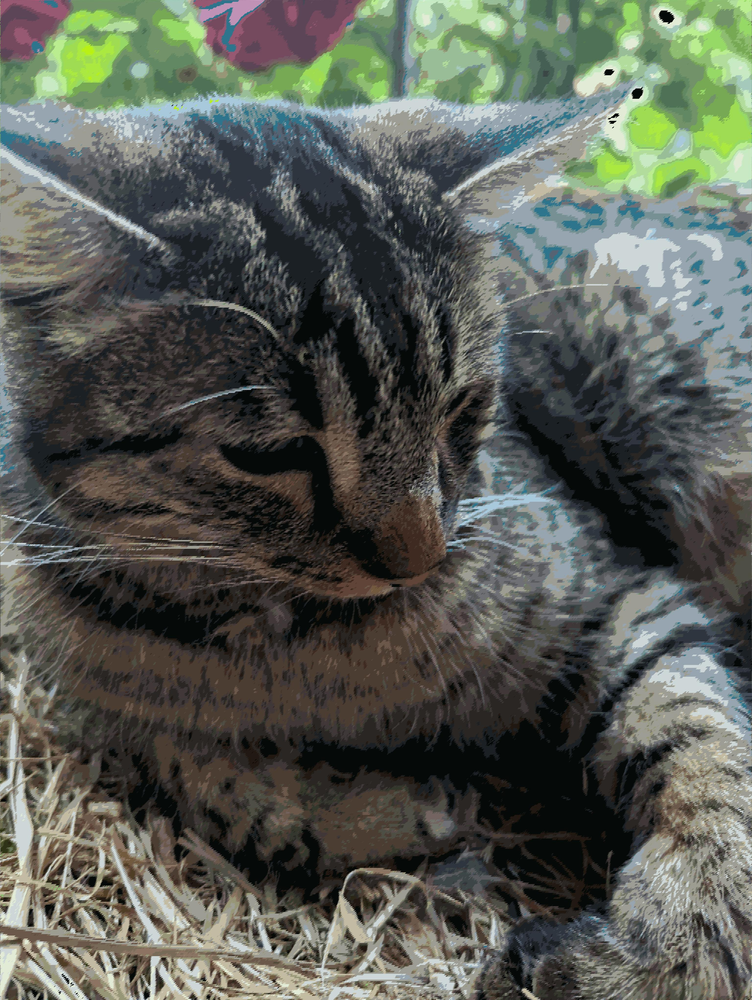

# The Colour Flattener And Also FPTP Image Scaler AKA De-AI-ifier-inator

This tool has two fundamental purposes, intended to be combined: Colour flattening and FPTP image scaling. It was created to sate my own curiosity and fit my own needs. It is provided here that it may serve you in some similar way. I find it quite interesting to play around with and see what does / doesn't look odd; It gives us some insight into human perception.

It goes without saying that this tool is provided **as-is** with no promise of usefulness. I have done my best to optimise the process, but processing high-resolution images still takes a moment. It is best used for small images such as pixel art, which is its intended use case.

This tool is intended and permitted for use by humans only such as to simplify drawing from an AI reference photo. Using it to improve AI-generated images without major manual alteration afterwards is not a permitted use.

## Colour flattening

The world is vibrant and even a basic 24 bit RGB colour space has more variation than human eyes could ever perceive or need.Look at this photo of my cat, Marvin.

Except, that's not a direct photo. It's the result of using this program to reduce the actual photo to 64 colours, an entire 0.0038% of the available 16 million 777 thousand 216 colours. 

Using a specialised image format, the photo could be saved using only 6 bit per pixel. Isn't that something! Here's the real photo.

The colours used in auto-detection mode are determined using a simple [k-means clustering algorithm](https://en.wikipedia.org/wiki/K-means_clustering). A set of k mean colours are randomly determined, then iteratively moved to minimise the total distance between actual colours and their closest mean colour. To determine distance between colours, the sum of squared distances between each colour component is used. However, colours are evaluated in CIELAB space, not RGB.

[CIELAB colour space](https://en.wikipedia.org/wiki/CIELAB_color_space) is a colour space that aims to more closely emulate human vision. From what I know of it, if two colours have similar components (L*, a*, b*) in CIELAB space, they ought to appear similar to human eyes. I am no colour expert, I have skimmed a few articles, but it seems to work where RGB famously isn't too accurate.

The program can also be run with a fixed colour space, in which case the k-means clustering is skipped. Colours are still compared in CIELAB space with a fixed colour space. See grayscale Marvin:

(Note: Mapping an otherwise vibrant image to a tiny colour space, in this case five shades from black to white, may have odd-looking effects.)

When mean colours are determined by either method, each pixel in the image is set to its closest mean colour as determined in CIELAB space.

## Image scaling

The second purpose of this tool is FPTP image scaling. The major use of this feature is the Square scaling method, which combines an NxN square of pixels into the same output colour. This is most like other image scalers and probably the most useful. See Marvin reduced to 32 colours and one-sixth resolution:

Note: No matter what scaling type is used, the image will always retain the same resolution once finished. If you truly desire a lower resolution version, you should be able to losslessly convert it using other tools if using the Square or Rectangle scaling types. The Slope scaling types are not intended for this purpose and frankly I am looking for a purpose for them still.

The scaling is referred to as FPTP, standing for First Past The Post, because it does not use an average of colours to determine the square's final colour. Rather, each pixel is polled for which colour it *would* turn into individually. Then all pixels in the square are turned into the colour with the most votes. This method feels like it produces better, more natural-looking output.

Other scaling types are Rectangle, downward Slope, and upward Slope, as seen here:

  

## Usage

An executable .jar file is included for convenience, but this is still very much not meant to be an end-user application, so console input (running out of a command line interface or IDE) is required. The program searches for image files in the same directory and places output files into output/<file_name>_out.<extension>.

The program has been very basically tested and appears to work with JPG and PNG files.

## De-AI-ifier?

The reason this project was called the De-AI-ifier is a personal peeve with image generation AIs. Since these tools do not perceive as humans do and generate each pixel somewhat individually, they have no restraint when it comes to colour. All too often, every single pixel is a different shade.

To me personally, the wide spectra of colours that AIs use, often with very soft borders and slow gradients, is very noticeable and off-putting. It is also a nuisance to artists using AI to generate reference images, which need to be manually flattened.

As such, I developed this tool mainly to take in an AI image and reduce its colour density in a natural way. The aim is to make images look more human-made, where artists often use a very countable number of shades, even when mixing colours.

A reminder: This tool is intended and permitted for non-commercial use by humans only such as to simplify drawing from an AI reference photo. Using it to improve AI-generated images without major manual alteration afterwards is not a permitted use.